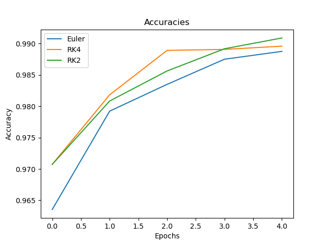

# Neural ODEs

An implementation of Neural ODEs in PyTorch, as described in the paper '[Neural Ordinary Differential Equations](https://arxiv.org/abs/1806.07366)'.

Currently supported ODE solvers are Euler's method, RK2, and RK4, which may be found in src.solvers

main.py demonstrates the model on the MNIST dataset, where an example of training is shown below.

# Example

Below shows the accuracies on MNIST after training for 5 epochs for each solver,

# References

**Neural Ordinary Differential Equations:** https://arxiv.org/abs/1806.07366
